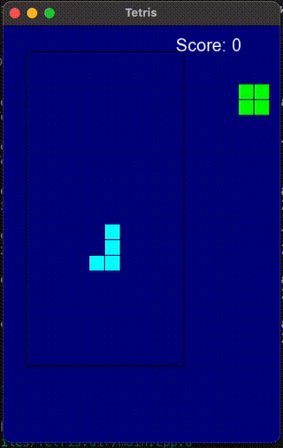

# Tetris

Простой клон Tetris, реализованный на C++ с использованием библиотеки SFML.

## Описание



Этот проект представляет собой классическую игру Tetris, где игрок управляет падающими фигурами, пытаясь создать полные линии, которые затем исчезают, увеличивая счет игрока. Игра продолжается до тех пор, пока фигуры не заполнят игровое поле.

## Установка

### Зависимости

Для сборки проекта вам потребуется:
- CMake (минимальная версия 3.10)
- Компилятор C++ с поддержкой C++11
- SFML (Simple and Fast Multimedia Library)

### Установка на macOS

1. Установите Homebrew, если он еще не установлен:

    ```sh
    /bin/bash -c "$(curl -fsSL https://raw.githubusercontent.com/Homebrew/install/HEAD/install.sh)"
    ```

2. Установите SFML с помощью Homebrew:

    ```sh
    brew install sfml
    ```

3. Клонируйте репозиторий и перейдите в его директорию:

    ```sh
    git clone https://github.com/AmpiroMax/Tetris
    cd tetris
    ```

4. Создайте папку для сборки и перейдите в нее:

    ```sh
    mkdir build
    cd build
    ```

5. Сгенерируйте проект с помощью CMake и соберите его:

    ```sh
    cmake ..
    make
    ```

6. Запустите игру:

    ```sh
    ./Tetris
    ```

## Как играть

- Используйте стрелки влево и вправо для перемещения фигуры по горизонтали.
- Нажмите стрелку вверх для вращения фигуры.
- Нажмите стрелку вниз для ускоренного падения фигуры.
- Цель игры — заполнять горизонтальные линии без пробелов. Когда линия заполнена, она исчезает, и вы получаете очки.
- Игра заканчивается, когда новые фигуры не могут появиться на игровом поле.

Приятной игры!

## Структура проекта
```
/path/to/your/project/
│
├── CMakeLists.txt
├── src/
│   ├── main.cpp
│   ├── Game.cpp
│   ├── Tetromino.cpp
│   └── Interface.cpp
└── include/
    ├── Game.h
    ├── Tetromino.h
    └── Interface.h
```